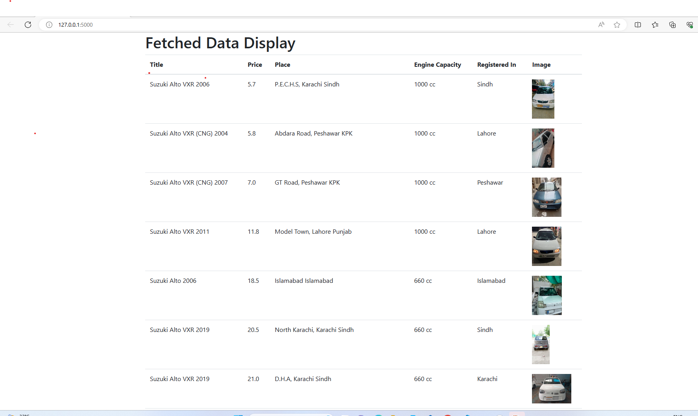

# pakwheel-Scrap-and-process-data-Task
This project aims to scrape records from PakWheels, clean and pass each record to a database using RabbitMQ to ElasticSearch. It also involves creating a Flask route to retrieve and process records using Pandas, then displaying the processed data using Flask's `render_template` feature.

## Technologies Used

- Python 3.6.6
- Flask
- Requests (for handling API requests)
- Beautiful Soup (for HTML parsing)
- Pandas (for data processing)
- Elasticsearch (for database storage)
- RabbitMQ (for message queuing)

## Procedure

1. **Scrape 100 Records from PakWheels:**
   The project scrapes data from PakWheels website to collect information about cars.

2. **Clean and Pass Records to Database using RabbitMQ:**
   After scraping, the data is cleaned and each record is passed to a database (ElasticSearch in this case) using RabbitMQ for better handling and distribution of tasks.

3. **Write a Flask Route:**
   A Flask web application is set up with routes for various functionalities.

4. **Get All Records from the Database:**
   A route is created to retrieve all records from the database (ElasticSearch).

5. **Process Records Using Pandas (Basic Sorting):**
   The retrieved records are processed using Pandas for basic sorting.

6. **Return Processed Data to Route and Display:**
   The processed data is returned to a Flask route, and it's displayed using Flask's `render_template` functionality.

## Setup Instructions

1. Clone the repository:
2. Install required packages using pip: 
3. Run the Flask application:
4. 
4. Open your web browser and navigate to `http://localhost:5000` to see the processed data displayed using the Flask app.

## Notes

- Replace `your_flask_script.py` with the actual name of your Flask script.
- Modify the project as needed for your specific use case.
- Feel free to contribute to this project by opening pull requests.

